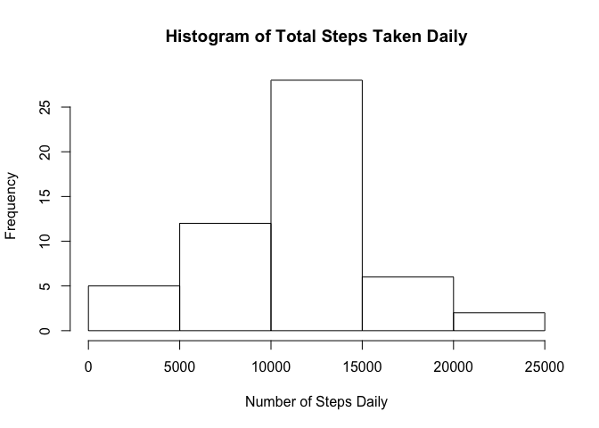
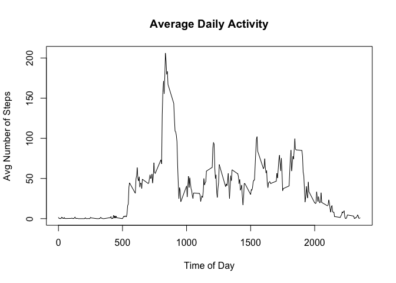
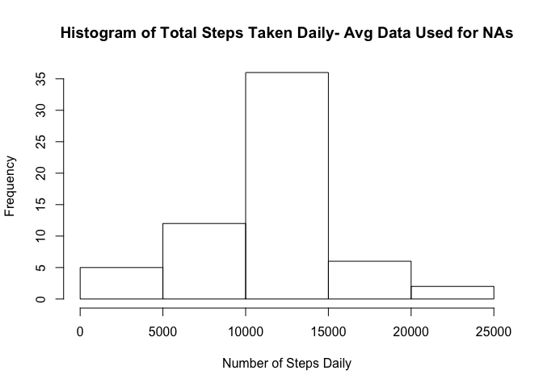
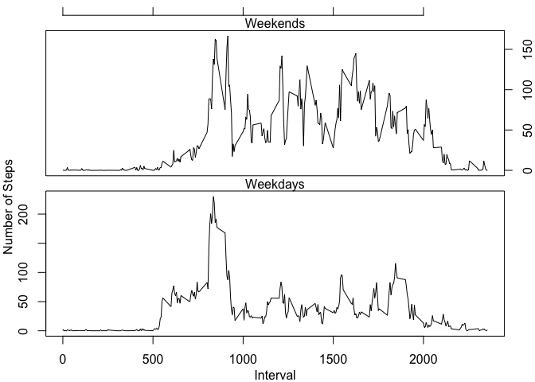

# Reproducible Research: Peer Assessment 1


## Loading and preprocessing the data
  

```r
     unzip("activity.zip",overwrite = TRUE) ## unzip data file
     rawData <- read.csv("activity.csv"); ## read in data
     rawData$date <- as.Date(rawData$date); ## change date column to date objects
```

## What is mean total number of steps taken per day?

     As can be seen in the graph below, the subject typically took between 10,000 and 15,000 steps per day.
     

```r
     cleanData <- rawData;
     cleanData <- cleanData[!is.na(cleanData$steps),]; ## strip out NA steps rows
     stepSums <- tapply(cleanData$steps,cleanData$date,sum); ## sum up steps taken per day
     hist(stepSums,main="Histogram of Total Steps Taken Daily", xlab = "Number of Steps Daily");
```



The average number of steps taken daily was 10,766.19, while the median value was 10,765.


```r
     mean <- mean(stepSums);
     median <- median(stepSums);
     df <- data.frame(mean,median);
     names(df) <- c("mean","median");
     return(df);
```

```
##       mean median
## 1 10766.19  10765
```


## What is the average daily activity pattern?

     The subject showed the most activity during the breakfast and getting ready for the day time. They also had brief spurts of activity around lunch and dinnertime as well. The subject's activity tails off as you would expect when they went to bed typically around 10 PM according to the data.
      

```r
     ## Average steps by 5 minute interval across all days, then plot average daily activty
     stepMeans <- tapply(cleanData$steps,cleanData$interval,mean); 
     plot(stepMeans ~ names(stepMeans), type = "l", main = "Average Daily Activity", xlab="Time of Day", ylab="Avg Number of Steps");
```



The subject took the most steps on average during a typical day between 8:35 and 8:40 AM, with a peak value of 206 steps during that 5 minute interval.


```r
     max <- max(stepMeans); ## Grab max value of means
     df <- data.frame(max,c(names(stepMeans)[stepMeans == max])); ## Grab corresponding time of the day where max mean occurs
     names(df) <- c("max", "time");
     return(df); ## Return max and time of the day
```

```
##        max time
## 1 206.1698  835
```


## Inputing missing values

     If instead of ignoring the 2,304 missing values of the steps taken in the data set, these data points are set to be the average number of steps taken for that time of day over all the other days with data for that time, nothing much changes in the data analysis. For example, according to the histogram below, the subject still takes 10,000 to 15,000 steps per day most often.


```r
     naCount <- length(rawData[is.na(rawData)]);
     
     ## Replace missing step counts with averages for that interval of time over all days found earlier in stepMeans
     modifiedData <- rawData;
     modifiedData$steps[is.na(modifiedData$steps)] <- stepMeans[match(modifiedData$interval[is.na(modifiedData$steps)],names(stepMeans))];
     
     stepSumsModified <- tapply(modifiedData$steps,modifiedData$date,sum);
     hist(stepSumsModified,main="Histogram of Total Steps Taken Daily- Avg Data Used for NAs", xlab = "Number of Steps Daily");
```



     The subject also has exactly the same average value of steps taken, and nearly the same median value of steps taken.


```r
     meanModified <- mean(stepSumsModified);
     medianModified <- median(stepSumsModified);
     df <- data.frame(naCount, mean, meanModified, median, medianModified);
     names(df) <- c("# of NAs","mean (orig)", "mean (mod)","median (orig)", "median (mod)");
     return(df);
```

```
##   # of NAs mean (orig) mean (mod) median (orig) median (mod)
## 1     2304    10766.19   10766.19         10765     10766.19
```


## Are there differences in activity patterns between weekdays and weekends?

     Based on the graphs below, the subject seems to be the busiest during the 8 - 10 AM range no matter whether it's a weekday or the weekend. However, the peak is much smaller relative to the other data in the set for the weekends, while the weekday peak around breakfast is much more pronounced. The weekend peak is also around 50 steps less than the peak during a typical weekday, but the subject took more steps on average during the rest of a weekend day than a weekday possibly indicating a more sedantary job during the week.


```r
     ## Define 2 types of days in a list to be selected from.
     dayTypes <- c("Weekday", "Weekend");
     
     ## If weekday() is Saturday or Sunday, select "Weekend" from dayTypes list. Otherwise select "Weekday".
     modifiedData$dayType <- dayTypes[(weekdays(modifiedData$date)=="Saturday"|weekdays(modifiedData$date)=="Sunday")+1]; 
     
     weekdayData <- modifiedData[modifiedData$dayType == "Weekday",];
     weekdayMeans <- tapply(weekdayData$steps,weekdayData$interval,mean);
     
     weekendData <- modifiedData[modifiedData$dayType == "Weekend",];
     weekendMeans <- tapply(weekendData$steps,weekendData$interval,mean); 
     
     ## Plot weekday and weekend data in a panel plot
     layout(c(2,1));
     
     par(mar=c(3,3,0,2));
     plot(weekdayMeans ~ names(weekdayMeans), type = "l")
     mtext("Interval",side=1, line=2);
     mtext("Weekdays",side=3);
     
     par(mar=c(1,3,2,2));
     plot(weekendMeans ~ names(weekendMeans), type = "l", xaxt='n', yaxt='n');
     axis(3,labels=FALSE,line=1);
     axis(4);
     mtext("Weekends",side=3);
     
     layout(c(1,1));
     mtext("Number of Steps",side=2,line=2);
```



     
